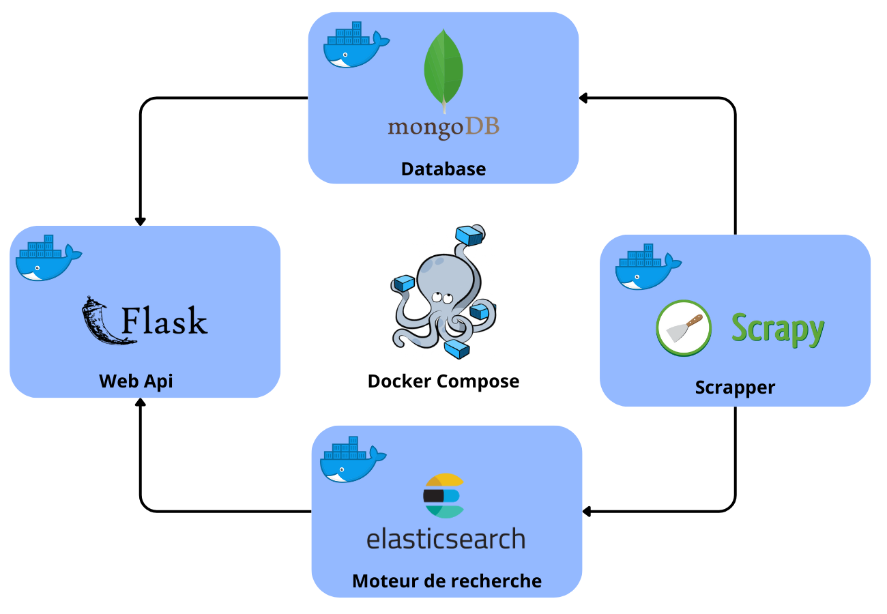
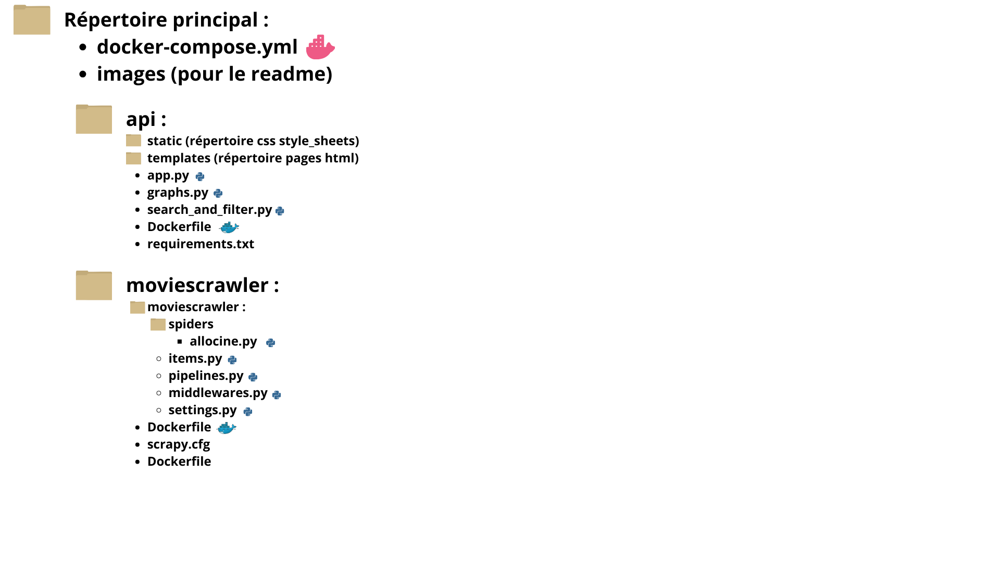
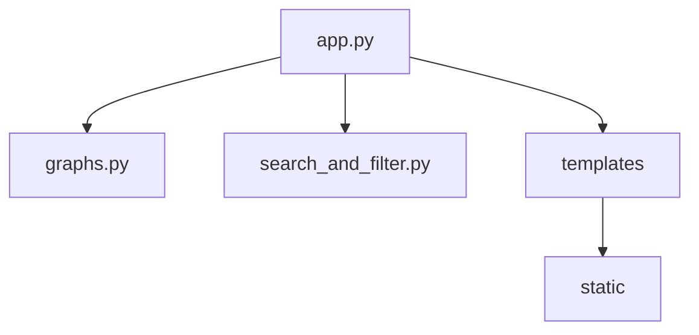
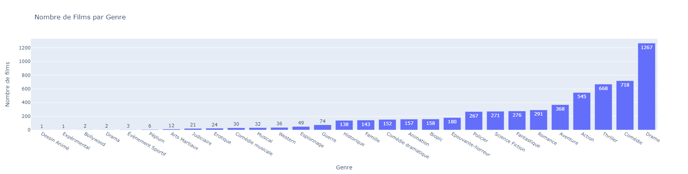
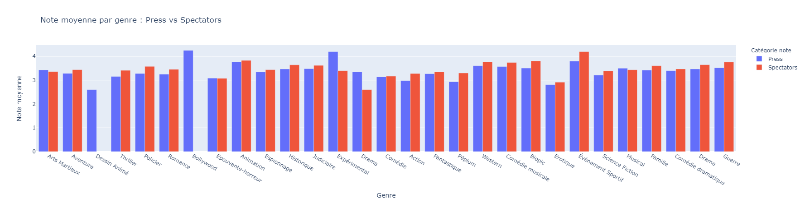
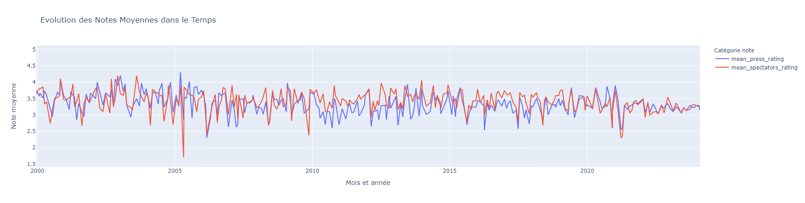

# Data Engineering : Web scraping project


## :mortar_board: Descripion du projet

L'objectif de ce projet est de récupérer tous les films présent sur le site Allocine à l'aide d'un outil de web scraping afin de les stocker dans une base de données. Ces films seront présentés dans une application web. Un onglet "Graphiques" permet de visualiser les données avec des graphiques tels que les genres de films les mieux notés, ou l'évolution de ces notes dans le temps.

> :mag_right: Lien du site scrapé : **[Allocine](https://www.allocine.fr/films/)**

## Architecture du projet :

### Docker
Le projet est séparé en **4 conteneurs**, orchestrés par **Docker Compose** qui permet de gérer plusieurs conteneurs dans le même contexte. Le fichier de configuration docker-compose.yml définit l'ensemble des conteneurs à instancier, les ports à mapper, ainsi que l'ordre dans lequel démarrer les services.
Ainsi, le projet peut être déployé sur n'importe quelle machine disposant de Docker et Docker-compose. 

##### Voici le schéma :



#### 1. Scrapy :
Scrapy est un framework python dédié au web scraping. Il permet de crawler des sites web et d'en extraire les données de façon structurée.
- **Spiders :**
Scrapy utilise des class, nommées Spider, qui définissent où démarrer le scraping et quels éléments extraire. Dans notre projet, nous utilisons une spider nommé allocine 
- **Items :**
Les items sont des conteneurs qui stockent les données extraitent par la spider. Nous utilisons deux items :
    - MovieItem : id, titre, image, genre, date, synopsis, cast, ratings
    Pour chaque film crawlé, les informations ci-dessus sont stockés dans l'item.
    - PersonItem : nom, role
    Pour chaque membre du casting, les informations ci-dessus sont stockés dans l'item
    > Remarque : le champ "cast" de MovieItem est une liste de PersonItem.
- **Pipelines :**
Les pipelines sont des composants de scrapy qui traitent chacun des items scrapé.
Nous utilisons 3 pipelines :
    - TextPipeline : traite les champs des items afin qu'ils soient tous normés et aient la structure souhaitée. (Exemple : la date au format datetime plutôt qu'une string)
    - MongoDBPipeline : cette pipeline charge chaque MovieItem dans la base de données Mongo.
    - ElasticsearchPipeline : cette pipeline indexe dans elasticsearch les champs titre, cast, synopsis et id pour chaque film.

> Un dockerfile a été créé pour la création du conteneur.

#### 2. MongoDB :
MongoDB est une base de données NoSQL open-source permettant de stocker les données sous forme de document au format JSON. L'un de ses principaux avantages est l'optimisation de la mémoire.
Tous les films scrapés sont chargés dans une base de données MongoDB qui sera accessible depuis l'api.

>L'image docker officiel est utilisé pour la création de son conteneur.

#### 3. Elasticsearch :
Elasticsearch est un moteur de recherche en temps réel. Il est conçu pour offrir des recherches rapides sur de grandes quantités de données, notamment textuelles.
Dans notre projet, nous indexons dans elasticsearch tous les champs textuels des films (titre, synopsis, cast) ainsi que leur identifiant.
Cela permet la recherche rapide d'un film à partir de texte. Après une recherche, elasticsearch retourne tous les films contenant les mots saisis dans leur titre,casting ou synopsis.
Les identifiants de ces films sont utilisés pour récupérer leurs informations dans la base de données MongoDB.

>L'image docker officiel est utilisé pour la création de son conteneur.

#### 4. Flask :
Flask est un framework web léger et flexible open source pour python. Il est conçu pour faciliter le développement d'applications web, tout en offrant les outils nécessaires pour développer des applications complexes.
L'application web de notre projet a été conçu avec Flask. Elle contient 3 templates de pages :
- index.html : Page principal affichant tous les films et des possibilités de recherche et filtrage.
- movie.html : Une page par film présentant toutes les informations de ce dernier.
- graphs.html : Page contenant des graphiques pour une visualisation des données stockés dans MongoDB.

L'application est lié à MongoDB et Elasticsearch afin d'accéder aux données et permettre la recherche par texte.

> Un dockerfile a été créé pour la création du conteneur.

### Structure des fichiers
##### Voici le schéma de la structure du projet :



#### Répertoire api :

- **graphs.py :** contient les fonctions permettant de tracer les graphiques
- **search_and_filter.py :** contient les fonctions permettant de filter les films et effectuer une recherche par texte
- **app.py :** Génère l'application et utilise les fonctions de **graphs.py** et **search_and_filter.py**



## User's Guide :

### Prérequis
Assurez-vous d'avoir installé Docker et Docker-compose sur votre machine.
Vous pouvez installer Docker desktop qui intégrera docker-compose par défaut.
> Lien de téléchargement : **[Docker desktop](https://www.docker.com/products/docker-desktop/)**

### Installation
Clonez le projet sur votre machine avec la commande suivante :
``` bash
git clone https://github.com/cassisir/DataEngineering-scraping_project.git
```
### Démarrage
1) Démarrer docker desktop
2) Ouvrir un terminal et se placer dans le répertoire du projet : ```cd path/to/projet``` 
2) Exécuter la commande suivante :  ```docker-compose up```
4) Ouvrir un navigateur et se rendre à l'url suivant : **http://localhost:5000/**

> **Remarque :** Le scraping pouvant prendre du temps, les films apparaitront au fur et à mesure sur l'application à chaque actualisation.

### Description des fonctionnalités
**1. Filtrer et trier les films :**
Au haut de la page se trouvent plusieurs éléments pour filtrer les films à afficher.
- **Barre de recherche :** recherche de films par titre, casting, ou synopsis
- **Filtrer par genre :** dropdown menu permettant de sélectionner un genre particulier
- **Trier par :** dropdown menu permettant de sélectionner le champ selon lequel afficher les films (date de sortie, note de la presse, note des spectateurs)
- **Sens du tri :** dropdown menu pour sélectionner le sens du tri (croissant ou décroissant)
- **Exclure non noté :** checkbox permettant de retirer les films non notés
- **Bouton "Appliquer" :** pour appliquer les filtres sélectionnés

**2. Accéder aux informations d'un film**
Cliquer sur une affiche d'un film redirige vers une page présentant toutes les informations de ce dernier (genre, notes, synopsis, casting...)

**3. Visualisation des données :**
Dans la barre de navigation de la page se trouve un bouton  **"Voir Graphiques"**  permettant d'accéder à trois graphiques interactifs pour une visualisation des données. 
- **Nombre de films par genre** : Bar chart présentant le nombre de films par genre. On voit que les drames sont les plus représentés.
- **Notes moyenne par genre : Presse vs Spectateurs :** Bar chart comparant les notes de la presse et des spectateurs pour chaque genre.
- **Evolution des notes moyennes dans le temps :** Line chart montrant l'évolution des notes moyennes de la presse et des spectateurs dans le temps. 


## Analyse des données :

### Bar chart : Nombre de films par genre


Ce graphique représente le nombre de films par genre. 
On peut voir que parmi les 29 genres représentés, le drame domine largement.


### Bar chart : Notes moyennes par genre


Ce graphique compare pour chaque genre, les notes de la presse et des spectateurs.
On remarque que pour la majorité des genres, les spectateurs ont tendance a attribué une note plus élevée.


### Line chart : Evolution des notes moyennes dans le temps



Au 21ème siecle, bien que les pics les plus bas ont été attribués par les spectateurs, on retrouve l'idée selon laquelle ces derniers ont tendance a donner des notes plus élevées que la presse.